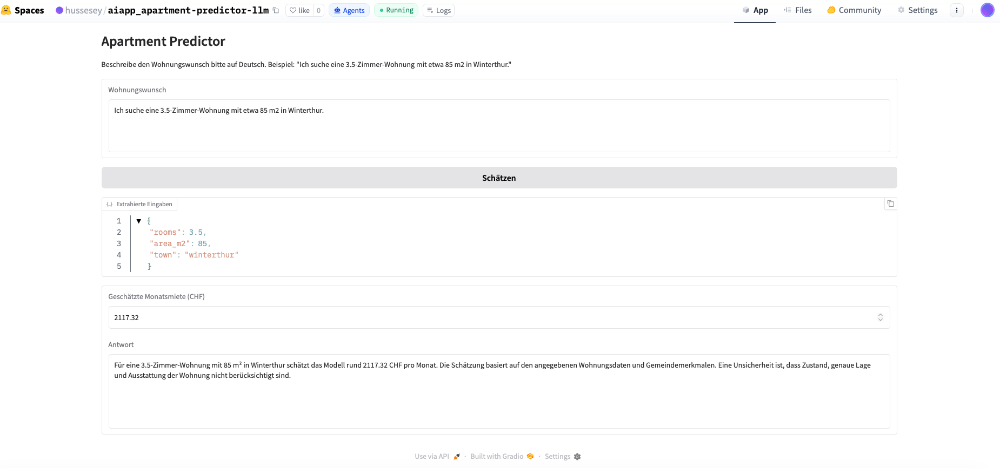
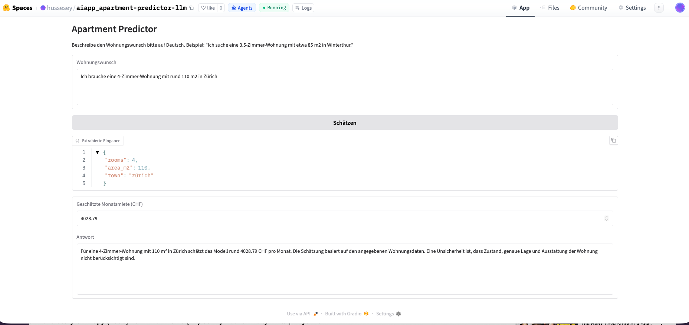

# Documentation
## Week 2: Apartment Predictor (Saved Regression Model + LLM Workflow)

Use this file to document what you built, tested, and learned in this exercise.

Do not rename this file to `README.md`, because `README.md` is needed by Hugging Face Spaces.

This file is part of the submission. Complete it after you have tested and deployed your app.

---

## 1. Project Summary

**Short description of your app:**  
This app accepts apartment requests in natural language (German) and estimates the monthly rent for an apartment in Switzerland. The user describes the number of rooms, floor area, and location – an LLM (OpenAI) extracts structured parameters from the text. A pre-trained Random Forest regression model calculates the rent estimate based on apartment and municipality characteristics. Finally, a second LLM call explains the result in plain language, including an uncertainty note.

---

## 2. Files Used

List the main files you worked with.

| File | Purpose |
|------|---------|
| `ai_applications_exercise2.ipynb` | Notebook: Development and testing of all functions |
| `app_student.py` | Student implementation with all TODOs filled in |
| `app.py` | Final app for deployment (copy of app_student.py) |
| `random_forest_regression.pkl` | Pre-trained Random Forest regression model |
| `bfs_municipality_and_tax_data.csv` | Municipality data (population, density, foreign resident share, employees, tax income) |
| `requirements.txt` | Python dependencies: openai, scikit-learn, numpy, pandas |
| `documentation.md` | This documentation |

---

## 3. Numeric Prediction Part

### 3.1 Reused Model

**Which saved model did you use?**  
`random_forest_regression.pkl`

**What does the model predict?**  
The model estimates the monthly rent (CHF) of an apartment based on apartment characteristics and municipality statistics.

**Which input features are used for prediction?**

1. `rooms` – Number of rooms (from the user)
2. `area_m2` – Living area in m² (from the user)
3. `pop` – Municipality population (from CSV)
4. `pop_dens` – Population density (from CSV)
5. `frg_pct` – Foreign resident share in % (from CSV)
6. `emp` – Number of employees (from CSV)
7. `tax_income` – Taxable income (from CSV)

### 3.2 Prediction Logic

The user provides `rooms`, `area_m2`, and `town`. Via town matching (exact match or contains-match) the municipality is identified in the CSV. The remaining 5 features (`pop`, `pop_dens`, `frg_pct`, `emp`, `tax_income`) are read from the corresponding row. All 7 values are passed as a NumPy array to `model.predict()`.

---

## 4. LLM Extraction Part

### 4.1 Goal

The LLM extracts three structured values from a free-text input in German: number of rooms (`rooms`), living area (`area_m2`), and municipality name (`town`).

### 4.2 Prompt Design

The prompt uses a system instruction with the following elements:

- Role: Specialized assistant for Swiss apartment search
- Strict JSON output required, no additional text
- Exactly three required keys defined: `rooms`, `area_m2`, `town`
- Numeric values required for `rooms` and `area_m2`
- A concrete example input/output pair provided
- `temperature=0` for consistent results

### 4.3 Expected Output Format

Document the ideal extraction output.

```json
{"rooms": 3.5, "area_m2": 85, "town": "Winterthur"}
```

### 4.4 Validation

Validation is performed in two steps:

1. `parse_json_response()` checks whether the LLM returns valid JSON with all required keys.
2. `match_town()` checks whether the extracted place name exists in the dataset (exact or via contains-match). If not, a `ValueError` is raised.

---

## 5. LLM Explanation Part

### 5.1 Goal

The second LLM call explains the already-calculated rent estimate in plain language. The LLM does not calculate a new price – it receives the value as input and formulates an understandable explanation.

### 5.2 Prompt Design

- Role: Helpful housing advisor in Switzerland
- Receives the apartment preferences (JSON) and the calculated estimate (CHF)
- Should respond with 2–3 sentences in German, explaining the estimateß
- Must mention an uncertainty or limitation
- Must not invent a new price
- Strict JSON output with key `answer`
- A concrete example output provided

### 5.3 Expected Output Format

```json
{"answer": "Für eine 3.5-Zimmer-Wohnung in Winterthur schätzt das Modell rund 2117 CHF pro Monat. Die Schätzung basiert auf Wohnfläche und Gemeindemerkmalen. Eine Unsicherheit ist, dass Zustand, Mikrolage und Ausstattung nicht im Modell enthalten sind."}
```

---

## 6. End-to-End Pipeline

1. The user enters an apartment request in German (e.g. "Ich suche eine 3.5-Zimmer-Wohnung mit 85 m2 in Winterthur.")
2. `extract_preferences()` sends the text to the LLM, which extracts `rooms`, `area_m2`, and `town` as JSON.
3. `parse_json_response()` validates the JSON and checks the required keys.
4. `match_town()` matches the place name against the dataset.
5. `predict_apartment_price()` fetches the municipality features from the CSV and calculates the rent via the Random Forest model.
6. `generate_explanation()` sends preferences + estimate to the LLM, which generates an explanation with an uncertainty note.
7. The Gradio UI displays: extracted JSON, estimated monthly rent (CHF), and explanation text.

---

## 7. Test Cases

Document at least 3 test inputs.

| Test Input | Extracted Output Correct? | Prediction Returned? | Explanation Returned? | Notes |
|------------|----------------------------|----------------------|-----------------------|-------|
| "Ich suche eine 3.5-Zimmer-Wohnung mit 85 m2 in Winterthur." | Yes | Yes (2117.32 CHF) | Yes | All values correctly extracted and explained |
| "Ich suche 2 Zimmer und etwa 55 m2 in Kloten." | Yes | Yes (1881.22 CHF) | Yes | Correctly recognized even without "Zimmer-Wohnung" phrasing |
| "Ich brauche eine 4-Zimmer-Wohnung mit rund 110 m2 in Zürich." | Yes | Yes (4028.79 CHF) | Yes | Zürich correctly matched, higher price is plausible |

---

## 8. Errors and Problems

**Problem 1:** `random_forest_regression.pkl` was missing from the repository.  
**Cause:** The file originated from an earlier exercise and was not included in the GitHub repo.  
**Fix:** Manually copied the model file from the earlier project into the project folder.

**Problem 2:** `ModuleNotFoundError: No module named 'openai'` during deployment.  
**Cause:** `requirements.txt` was initially not uploaded to HuggingFace.  
**Fix:** Uploaded `requirements.txt` without fixed version numbers.

**Problem 3:** Sklearn warning "X does not have valid feature names".  
**Cause:** The model was trained with a DataFrame (with column names), but prediction uses a NumPy array.  
**Fix:** The warning is harmless and does not affect results – ignored.

---

## 9. Deployment Notes

Document your Hugging Face deployment here.

### 9.1 Files included

- `app.py`
- `random_forest_regression.pkl`
- `bfs_municipality_and_tax_data.csv`
- `requirements.txt`
- `documentation.md`
- `README.md`

### 9.2 Secrets / Environment Variables

- `LLM_API_KEY` – OpenAI API Key (as HuggingFace Secret)
- `LLM_MODEL` – `gpt-5.4-mini` (as HuggingFace Secret)

### 9.3 Deployment Result

The Space runs successfully on HuggingFace Spaces with the Gradio SDK. All functions (extraction, prediction, explanation) work correctly.

### 9.4 Screenshots

Add **2 screenshots** from your running app here.




---

## 10. Reflection

The combination of the Random Forest model and LLM works well: the model provides a consistent numerical estimate, while the LLM makes the user interaction natural and easy to understand. The biggest weakness is the town matching – unusual spellings or places outside the dataset lead to errors. German prompts are important because the dataset contains Swiss place names and the LLM only extracts them correctly when the input and dataset language match. The model lacks important features such as apartment condition, micro-location, year of construction, and furnishing standard. As a next step, I would add an autocomplete function for place names and additional features to the model.

---

## 11. Responsible Use Note

The rent estimate is only a guideline and must not be understood as a binding price quote. The model exclusively uses structured municipality characteristics – individual factors such as condition, floor, renovation, furnishings, and exact location are missing. The LLM can occasionally misinterpret inputs, especially with ambiguous or incomplete text. Real rental decisions should always be based on a professional assessment.
